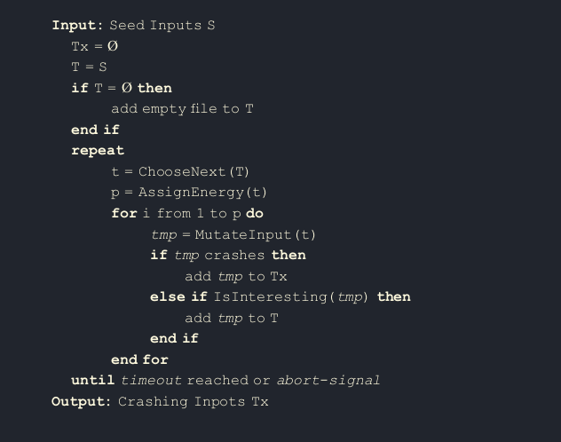
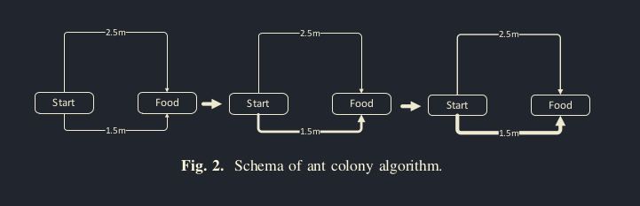
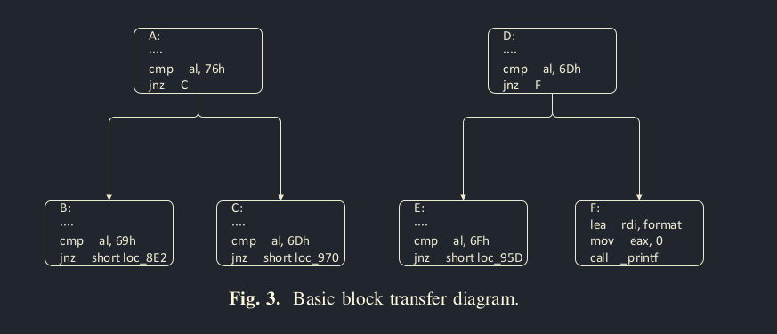

# Greybox Fuzzing based on Ant Colony Algorithm

## Abstract

Kiểm thử mờ (Fuzzing or Fuzz testing) hộp xám là một loại công nghệ phổ biến hiện nay sử dụng để dẫn dắt hướng đi của fuzzer bằng cách thu thập thông tin của các đường dẫn trong quá trình thực thi. Kiểm thử mờ hộp xám đánh giá hạt giống của một mẫu qua độ sâu của đường dẫn, thời gian thực thi, và liệu rằng có tồn tại đường mới được tạo ra không, điều này được đánh giá là không đầy đủ để để hoàn toàn đánh giá chất lượng của hạt giống. Vì vậy trong bài báo này sẽ sử dụng cách chọn giống tốt hơn qua ant colony algorithm. Bằng cách xem xét xác suất để một basic block di chuyển sang một basic block khác, chúng ta có thể xác định được mẫu hạt giống nào có xác suất cao hơn trong việc được đột biến.

## Background

### Coverage-based Greybox Fuzzing

Kiểm thử mờ hộp xám dựa trên độ bao phủ chèn mã vào chương trình đang được kiểm thử sao cho có thể thu thập được trạng thái thực thi của từng nhánh lệnh trong quá trình thực thi của chương trình qua các ca kiểm thử và sẽ đánh giá những ca kiểm thử đó qua thông tin thu thập được trong quá trình chạy chương trình. Chỉ có những ca kiểm thử, còn gọi là hạt giống sẽ được lưu lại để tiếp tục tạo ra các hạt giống mới cho các thế hệ sau qua các quá trình biến đổi và giao phối.

 
### Ant Colony Algorithm
Thuật toán đàn kiến là một phương pháp tối ưu hóa dựa trên hành vi tìm kiếm thức ăn của đàn kiến. Các đàn kiến có thể tìm được đường đi ngắn nhất để đến đồ ăn thông qua việc truyền thông tin bằng "pheromone".
Ban đầu đàn kiến sẽ đi ngẫu nhiên để tìm đồ ăn, làm mở ra nhiều đường từ tổ tới đồ ăn. Dựa vào chất lượng và số lượng đồ ăn, kiến sẽ để lại "pheromone" trên đường trở về, tăng xác suất đi đường đó. Cùng với đó là sự bốc hơi của "pheromone" cũng làm ảnh hướng tới tính chất khoảng cách của đường đi.

## Ant Colony Algorithm mode

Giả sử có một mẫu hạt giống M gồm đường (A, B), một mẫu hạt giống N đường (D, E). Ta muốn một hạt giống có thể tìm thêm đường mới. Vì vậy, giả sử xác suất P(A,B) > P(D, E), ta có xác suất của hai đường mới P(A, C) = 1 - P(A, B) và P(D, F) = 1 - P(D, E), ta sẽ được P(A, C) < P(D, F), vậy mẫu sẽ được chọn kế tiếp sẽ là mẫu N do mẫu N có xác suất sản sinh ra đường mới cao hơn.
Qua quan sát trên, ta thấy rằng khi xác suất của một basic block A di chuyển sang basic block B lớn hơn, thì xác suất để tìm được một con đường mới giảm. 
Giả sử mỗi mẫu hạt giống được đưa vào là một con kiến và đồ thị luồng thực thi tạo ra từ đó là một đường và mỗi con kiến sẽ để lại trên con đường đó một luồng "pheromono",
 
## Experiments and Results

## Limitation

